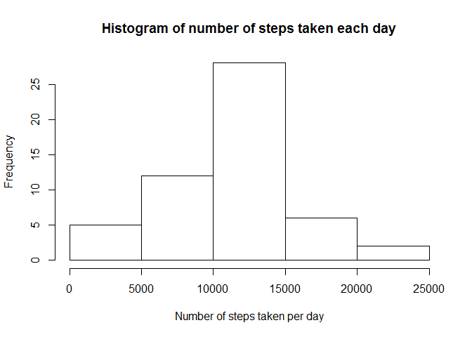
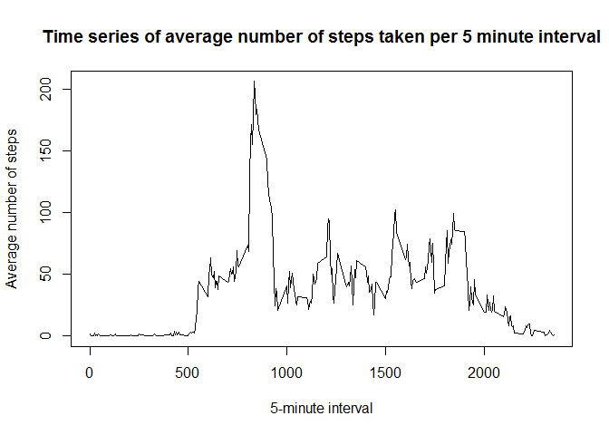
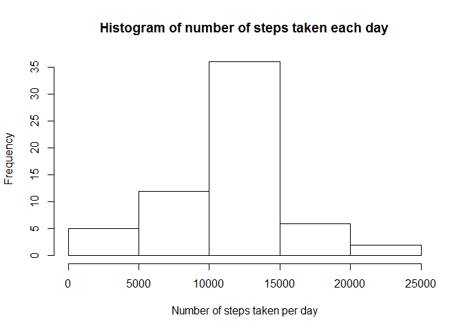
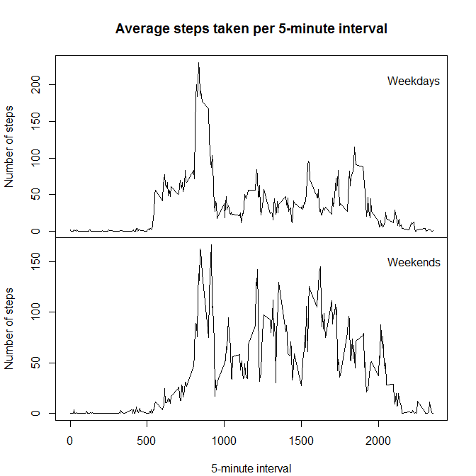

# Reproducible Research Assignment 1
Juliana S Capitanio  
August 10, 2014  
##Loading and preprocessing the data

**Load the data. Process the data into a format suitable for your analysis.**


```r
temp <- tempfile(fileext = ".zip")
url <- "https://d396qusza40orc.cloudfront.net/repdata%2Fdata%2Factivity.zip"
setInternet2(use = TRUE)
download.file(url, destfile = temp)
activity <- read.csv(unzip(temp))
rm(temp)
rm(url)
head(activity)
```

```
##   steps       date interval
## 1    NA 2012-10-01        0
## 2    NA 2012-10-01        5
## 3    NA 2012-10-01       10
## 4    NA 2012-10-01       15
## 5    NA 2012-10-01       20
## 6    NA 2012-10-01       25
```

##What is the mean total number of steps taken per day?

**Make a histogram of the total number of steps taken each day.**


```r
sumstepsday <- tapply(activity$steps, activity$date, sum)
hist(sumstepsday, main="Histogram of number of steps taken each day", xlab="Number of steps taken per day")
```

 

**Calculate and report the mean and median total number of steps taken per day**


```r
meanstepsday <- mean(sumstepsday, na.rm=TRUE)
medianstepsday <- median(sumstepsday, na.rm=TRUE)
```

The mean steps per day is : 1.0766 &times; 10<sup>4</sup>.
The median steps per day is: 10765.

##What is the average daily activity pattern?

**Make a time series plot of the 5-minute interval and the average number of steps taken, averaged across all days.**


```r
stepintervavg <- tapply(activity$steps, activity$interval, mean, na.rm=TRUE)
intervals <- levels(as.factor(activity$interval))
plot(x=intervals,y=stepintervavg, type= "l", main = "Time series of average number of steps taken per 5 minute interval", xlab = "5-minute interval", ylab = "Average number of steps")
```

 
  
**Which 5-minute interval, on average across all the days in the dataset, contains the maximum number of steps?**
  

```r
maxstepsinter <- intervals[order(stepintervavg, decreasing = TRUE)[1]]
```
  
The 5-minute interval with average maximum number of steps is 835.
  
##Imputing missing values
  
**Calculate and report the total number of missing values in the dataset.**
  

```r
casesNA <- sum(!complete.cases(activity))
```
  
There are 2304 incomplete cases in the dataset.
  
**Devise a strategy for filling in all of the missing values in the dataset. Create a new dataset that is equal to the original dataset but with the missing data filled in.**
  
The missing values in the dataset were replaced by the mean for that same interval among all days analyzed.


```r
activityNArm <- activity
activityNArm$interval <- as.factor(activityNArm$interval)

library(plyr)
impute.mean <- function(x) replace(x, is.na(x), mean(x, na.rm = TRUE))
activityNArm <- ddply(activityNArm, ~ interval, transform, steps = impute.mean(steps))
head(activityNArm)
```

```
##    steps       date interval
## 1  1.717 2012-10-01        0
## 2  0.000 2012-10-02        0
## 3  0.000 2012-10-03        0
## 4 47.000 2012-10-04        0
## 5  0.000 2012-10-05        0
## 6  0.000 2012-10-06        0
```
  
**Make a histogram of the total number of steps taken each day and Calculate and report the mean and median total number of steps taken per day.**


```r
sumstepsdayNArm <- tapply(activityNArm$steps, activityNArm$date, sum)
hist(sumstepsdayNArm, main="Histogram of number of steps taken each day", xlab="Number of steps taken per day")
```

 

```r
meanstepsdayNArm <- mean(sumstepsdayNArm)
medianstepsdayNArm <- median(sumstepsdayNArm)
```

After imputting the missing values, the mean total number of steps taken per day is 1.0766 &times; 10<sup>4</sup> and the median is 1.0766 &times; 10<sup>4</sup>. This mean value does not differ from the previous calculation, while the median value has increased slightly now matching the mean.  
Imputing missing values increases the frequency of days with total number of steps between 10000 and 15000.  


##Are there differences in activity patterns between weekdays and weekends?

**Create a new factor variable in the dataset with two levels - "weekday" and "weekend" indicating whether a given date is a weekday or weekend day.**


```r
activityNArm$date <- as.Date(activityNArm$date, format = "%Y-%m-%d")
activityNArm$dayofweek <- weekdays(activityNArm[,2])
activityNArm$dayofweek <- as.factor(ifelse(activityNArm$dayofweek == "Saturday" | activityNArm$dayofweek == "Sunday", "weekend", "weekday"))
head(activityNArm)
```

```
##    steps       date interval dayofweek
## 1  1.717 2012-10-01        0   weekday
## 2  0.000 2012-10-02        0   weekday
## 3  0.000 2012-10-03        0   weekday
## 4 47.000 2012-10-04        0   weekday
## 5  0.000 2012-10-05        0   weekday
## 6  0.000 2012-10-06        0   weekend
```

**Make a panel plot containing a time series plot (i.e. type = "l") of the 5-minute interval (x-axis) and the average number of steps taken, averaged across all weekday days or weekend days (y-axis).**


```r
stepintervavgWD <- tapply(activityNArm[activityNArm$dayofweek == "weekday", 1], activityNArm[activityNArm$dayofweek == "weekday", 3], mean)
stepintervavgWE <- tapply(activityNArm[activityNArm$dayofweek == "weekend", 1], activityNArm[activityNArm$dayofweek == "weekend", 3], mean)

layout(matrix(1:2, ncol = 1), widths = 1, heights = c(2,2), respect = FALSE)
par(mar = c(0, 4.1, 4.1, 2.1))
plot(x=intervals,y=stepintervavgWD, type= "l", main = "Average steps taken per 5-minute interval", xaxt = 'n', ylab = "Number of steps")
text(x=3425, y=205, "Weekdays", 4)
par(mar = c(4.1, 4.1, 0, 2.1))
plot(x=intervals,y=stepintervavgWE, type= "l", xlab = "5-minute interval", ylab = "Number of steps")
text(x=2750, y=150, "Weekends", 2)
```

 
